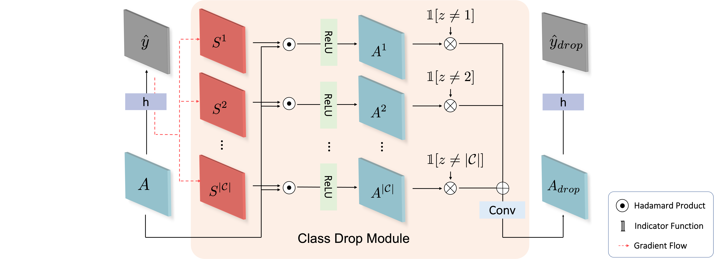

# Learning Debiased and Disentangled Representations for Semantic Segmentation
Sanghyeok Chu, Dongwan Kim, Bohyung Han.
<div>

</div>

This is an official pytorch implementation of **["Learning Debiased and Disentangled Representations for Semantic Segmentation"](https://proceedings.neurips.cc/paper/2021/file/465636eb4a7ff4b267f3b765d07a02da-Paper.pdf)**, which proposes a model-agnostic and stochastic training scheme for semantic segmentation that facilitates the learning of debiased and disentangled representations.\\
ClassDrop module and its relevant objective functions are implemented in ./lib/model/seg_hrnet.py

Codes are highly referenced from [HRNet(pytorch-v1.1)](https://github.com/HRNet/HRNet-Semantic-Segmentation/tree/pytorch-v1.1).
For train and test the model, please refer to the link.

#### Citation
If you use this code in a publication, please cite our paper.

```
@article{chu2021learning,
    title={Learning Debiased and Disentangled Representations for Semantic Segmentation},
    author={Chu, Sanghyeok and Kim, Dongwan and Han, Bohyung},
    journal={Advances in Neural Information Processing Systems},
    year={2021}
}
```
